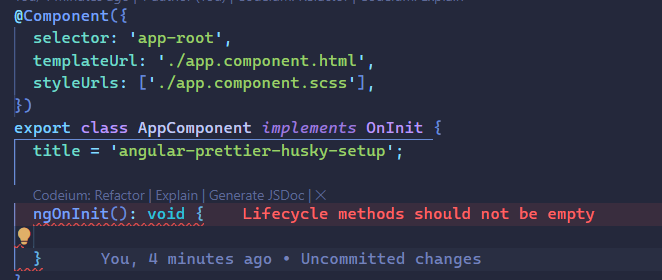

# Angular 14 + Prettier + Husky Setup

The purpose of this post, is to share in a simple and hopefully useful way how we can implement Prettier and Husky in an Angular 14 application, but before we start you might be wondering what is Prettier, or maybe more specifically **WHAT THAT HELL IS [HUSKY](https://typicode.github.io/husky)**?

## What is [Prettier](https://prettier.io) 😎?

**Prettier** is an popular and opinionated code formatter. It is a tool that helps you enforce consistent code style across your codebase. It is a great tool when you are working with JavaScript, TypeScript, CSS, and other languages, definitely is a great way to keep formatted code consistently across your team.

## What is [Husky](https://typicode.github.io/husky) 🐶?

**Husky**: Of course! Let's focus on this impressive tool rather than discussing the charming breed of dogs known as Huskies.

Husky is described as a tool that simplifies Git hooks. It offers pre-commit and pre-push hooks, which are essentially commands you want to execute each time you commit or push changes.

In this post, we'll demonstrate how to set up Husky and Prettier in an Angular 14 application to streamline and automate code formatting, and detect potential issues/errors in your code.

## Let's get started!

### 1. Create a new Angular 14 project

Create a new Angular 14 project using the CLI and run the project with the following command (in this case the project name is `angular-prettier-husky-setup`, you can name it whatever you want):

_Make sure you have installed NodeJS version 16 minimum, in order to install the Angular CLI, if you don't have it installed on your operating system, for more details on how to install NodeJS, see this [link](https://docs.npmjs.com/downloading-and-installing-node-js-and-npm), as well as the documentation of (Angular CLI)[https://angular.io/cli], for more details on the Angular CLI, and its installation process._

```bash
ng new angular-prettier-husky-setup
```

_Feel free to use the package manager of your choice to install the Angular CLI._

## 2. Install ESlint

Angular provides us with a powerful ESLint that helps us detect and correct errors in our code. Therefore, we are going to install it in the project.

For this, we can refer to the following documentation to find out which version of ESLint it offers:

> ng add @angular-eslint/schematics@12 #for angular 12

> ng add @angular-eslint/schematics@13 #for angular 13

> ng add @angular-eslint/schematics@14 #for angular 14

In this case, when working with Angular 14, we use version 14. Therefore, we are going to install it:

```bash
ng add @angular-eslint/schematics@14
```

This will automatically install the necessary dependencies and also perform the necessary configurations, such as adding the registration of the different Schematics used in the 'schematicCollections' property in 'angular.json', among other adjustments.


"But let's see what changes were made; let's analyze in detail the modifications made to the files."

`.eslintrc.json`: This file contains the rules of the linter that we will use to check if the code complies with the established rules, and if not, provide us with feedback about the errors that have occurred.

By default, the `.eslintrc.json` file is located in the root directory of the project and contains the default configuration.

```json
{
  "root": true,
  "ignorePatterns": ["projects/**/*"],
  "overrides": [
    {
      "files": ["*.ts"],
      "parserOptions": {
        "project": ["tsconfig.json"],
        "createDefaultProgram": true
      },
      "extends": [
        "plugin:@angular-eslint/recommended",
        "plugin:@angular-eslint/template/process-inline-templates"
      ],
      "rules": {
        "@angular-eslint/directive-selector": [
          "error",
          {
            "type": "attribute",
            "prefix": "app",
            "style": "camelCase"
          }
        ],
        "@angular-eslint/component-selector": [
          "error",
          {
            "type": "element",
            "prefix": "app",
            "style": "kebab-case"
          }
        ]
      }
    },
    {
      "files": ["*.html"],
      "extends": ["plugin:@angular-eslint/template/recommended"],
      "rules": {}
    }
  ]
}
```

`angular.json`: This file contains the configuration of the Angular application. It is automatically modified to add the registration of the schematics collections and information about the schematics we just installed.


`package.json`: A new script called `ng lint` was added to execute the Angular linter, along with the update of dependencies.


With all the changes in place, we can proceed with the next steps.

## 3. Install Prettier

To perform code error correction, we'll install Prettier as a development dependency in our project. To do this, we'll use the following command:

_(Feel free to use your preferred package manager. In this case, and throughout the rest of the post, we'll use npm as the package manager.)_

```bash
npm install --save-dev prettier
```

## 4. Configure Prettier

Let's configure Prettier to perform code error correction. To do this, we'll create a file named `.prettierrc` in the root of the project directory, and we'll add the following suggested configuration:

```json
{
  "printWidth": 100,
  "tabWidth": 2,
  "tabs": false,
  "singleQuote": true,
  "semicolon": true,
  "quoteProps": "preserve",
  "bracketSpacing": true
}
```

`printWidth`: Defines the maximum line width before Prettier will break lines automatically to keep the code within this limit.

`tabWidth`: Sets the width of a tab, i.e., how many spaces a tab represents.

`tabs`: A boolean indicating whether tabs should be used instead of spaces..

`singleQuote`: A boolean specifying whether single quotes should be used instead of double quotes for strings..

`semicolon`: A boolean indicating whether semicolons should be included at the end of statements.

`quoteProps`: Defines how Prettier will handle quotes around object property names. In this case, 'preserve' means it will keep the quotes if they are needed for backward compatibility.

`bracketSpacing`: A boolean indicating whether there should be a space after opening parentheses and before closing parentheses in object literals.

---

### `.prettierignore` Configuration:

Now we'll create a file in the root of the project called .prettierignore and add the following configuration:

```prettier
package.json
package-lock.json
yarn.lock
node_modules
dist
```

This allows Prettier to ignore files that we don't want to be corrected for errors in our code, so we don't have to worry about them being analyzed by Prettier.

## 5. Install Pretty Quick

_Pretty Quick_ is a tool that combines two popular JavaScript tools: Prettier and ESLint, to format and lint your code efficiently. Prettier takes care of automatically formatting the code, while ESLint is used to perform static code analysis for errors or unwanted practices.

_Pretty Quick_ simplifies the code formatting and linting process by running both tools in parallel. This means you can format and lint your code with a single command or easily integrate it into your development workflow.

Additionally, we only want Prettier to perform error correction on our modified files, instead of ESLint correcting errors in all files of the project. That's why Pretty Quick will also analyze only the modified files in our project. To achieve this, we need to execute the following command to install Pretty Quick as a development dependency in our project:

```bash
npm install --save-dev pretty-quick
```

Once Pretty Quick is installed, we'll add a new script in the `package.json` file, which will be responsible for correcting errors only in the files that have been staged for commit in Git, using the `--staged` flag.

```json
{
  "scripts": {
    "pretty-quick": "pretty-quick --staged"
  }
}
```

# 6. Install Husky

Alright, now we can finally proceed with installing Husky.
To do this, we need to follow the documentation and execute the following command:

```bash
 npx husky-init && npm install
```

This will create a new directory in the root of the project called `.husky`, along with all the necessary files for the `husky` command to work.

By default, inside this folder, you will find a file named `pre-commit` with the following content:

```bash
#!/usr/bin/env sh
. "$(dirname -- "$0")/_/husky.sh"

npm test
```

You replace `npm test` with the command you want to execute. In this case, you replace it with `npm run pretty-quick`.

```bash
#!/usr/bin/env sh
. "$(dirname -- "$0")/_/husky.sh"

npm run pretty-quick
```

Remember, this command was added to the `package.json` file in step #2.

Now, we'll add a new file inside the same `.husky` folder called `commit-msg` with the following content:

```bash
#!/usr/bin/env sh
. "$(dirname -- "$0")/_/husky.sh"

npm run lint
```

_Note: If you're running unit tests in your project, you could add a new file in the same `.husky` folder called `pre-push` with the following content:_

```bash
#!/usr/bin/env sh
. "$(dirname -- "$0")/_/husky.sh"

npm run test
```

_to run unit tests before pushing to the remote branch of your repository where you're working._

For this simple example, we will only use the files `.husky/pre-commit` and `.husky/commit-msg`.

# Testing Prettier + ESLint + Husky Error Correction

Now that we have the project set up to run pre-commit and commit-msg commands, let's test that everything works correctly.

To do this, let's introduce an error in our application. We'll go to the `app.component.html` file and modify it as follows:

```html
<h1>Angular 14 + Prettier + Husky</h1>

<div>
  <span> Este es un texto que NO debe Ser Valido Para Nuestro Linter Prettier </span>
</div>
```

and in the `app.component.ts` file, we will implement the `OnInit` lifecycle hook, but we'll leave the content of the lifecycle hook empty so that the linter indicates it as an error.



Alright, now it's time to test that everything works correctly. With Husky configured and using the `pre-commit` and `commit-msg` hooks, we'll execute the following commands:

1. We'll add the files to the Git staging area:

```bash
git add .
```

This will allow us to confirm that all files have been staged for commit by Husky.

2. We'll make the commit:

```bash
git commit -m "feat: Added Setup Prettier + ESLint + Husky"
```

This will format the code according to the rules established in the `.prettierrc` and `.eslintrc.json` files. Therefore, the HTML will be validated by Prettier and the `.eslintrc.json` file by ESLint, resulting in:

```HTML
<h1>Angular 14 + Prettier + Husky</h1>

<div>
  <span> Este es un texto que NO debe Ser Valido Para Nuestro Linter Prettier </span>
</div>
```

However, when trying to commit with an error that we intentionally caused for testing purposes, the commit is not completed, and it indicates that the error occurred due to the correction of errors by Prettier and ESLint.


This personally seems incredible to me!

Now we proceed to correct the errors.


We will try to create the commit again:


And in this case, the commit has been successfully completed, as the error correction has been performed properly, and the code complies with the established linter rules.

## Conclusion

Prettier + ESLint + Husky + Git + Git Hooks is a solution to automatically correct errors in an Angular 14 project. In addition to being an alternative to improve/detect error correction manually, these tools, like many others, are just a tool to detect the fire, not extinguish it. Therefore, despite being a great asset for our projects, we must not forget how important and careful we must be when creating incredible solutions/projects, whether they are personal or intended to help others.
